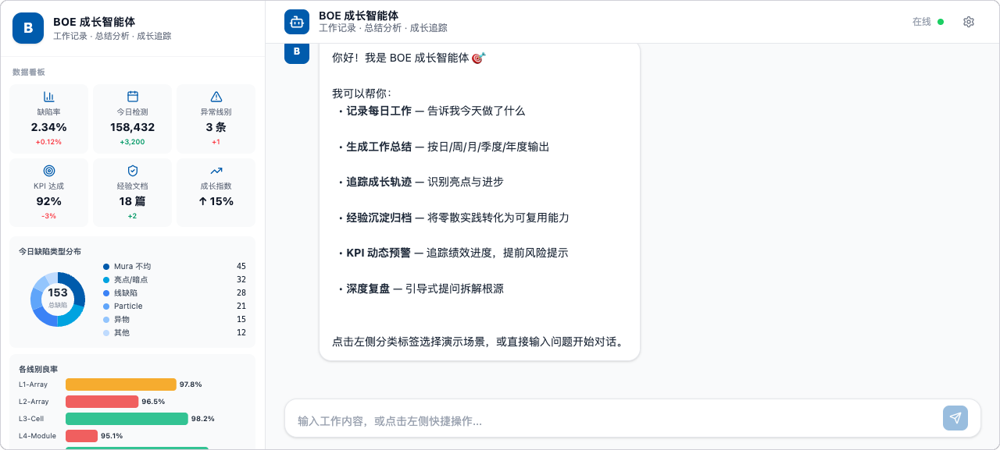
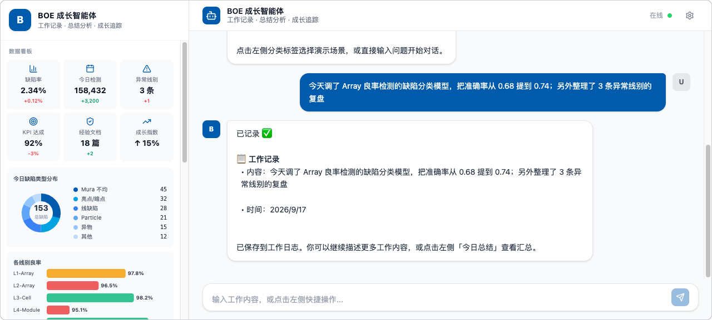

# BOE 成长智能体

> 京东方团队工作记录与成长追踪 AI 助手，基于 Coze API 构建。

## 功能

- **记录每日工作** — 对话式输入，自动提取日期、项目、成果
- **智能总结** — 按日/周/月/季度/年度生成结构化工作报告
- **亮点识别** — 自动标记工作中的成长点与核心成果
- **网页端配置** — 在 UI 内直接填入 Coze API 地址与密钥，无需改代码

## 界面

左侧是数据看板（缺陷率 / 今日检测 / 异常线别 / KPI 达成 / 不良类型分布 / 各线别良率），右侧是对话区：



随手说一句今天做了什么，自动整理成带日期、内容、亮点的结构化条目：



> 截图取自未配置 Coze API 时的 **Demo 模式**（由本地模拟逻辑响应），用于展示 UI 与交互流程。

## 快速开始

### 环境要求

- Node.js >= 18
- npm 或 yarn

### 安装与启动

```bash
# 1. 安装依赖
npm install

# 2. 启动（同时启动前端 + 后端）
npm run start
```

浏览器打开 **http://localhost:5173** 即可使用。

### 配置 Coze API（可选）

**方式一：网页端配置（推荐）**

1. 启动应用后，点击右上角齿轮图标 ⚙️
2. 填入 API 地址、Token、Bot ID
3. 点击「保存配置」

配置保存在浏览器 localStorage 中，不会上传至第三方服务器。

**方式二：环境变量**

编辑项目根目录 `.env` 文件：

```env
COZE_API_BASE=https://api.coze.cn
COZE_API_TOKEN=your_api_token_here
COZE_BOT_ID=your_bot_id_here
```

### 获取 Coze API 凭证

1. 登录 [coze.cn](https://www.coze.cn)
2. 进入 [开放平台](https://www.coze.cn/open/docs) → 个人令牌 → 创建 Token
3. 创建智能体 → 设置页面找到 Bot ID

## 未配置 API 时

应用会自动进入 **Demo 模式**，使用本地模拟逻辑响应，方便预览 UI 和交互流程。

## 技术栈

| 层级 | 技术 |
|------|------|
| 前端 | React 19 + Vite + Tailwind CSS 4 |
| 后端 | Express 5（Node.js） |
| AI 接口 | Coze Open API v3 |
| 图标 | Lucide React |

## 项目结构

```
boe-growth-agent/
├── server/
│   └── index.js              # Express 后端，Coze API 代理
├── src/
│   ├── components/
│   │   ├── Header.jsx         # 顶栏 + 设置入口
│   │   ├── Sidebar.jsx        # 侧边栏（快捷操作 + 数据看板）
│   │   ├── ChatPanel.jsx      # 聊天主界面
│   │   └── SettingsModal.jsx  # API 配置弹窗
│   ├── App.jsx
│   ├── main.jsx
│   └── index.css
├── assets/                    # README 用的界面截图
├── .env                       # 环境变量配置
├── vite.config.js
└── package.json
```

## License

MIT
